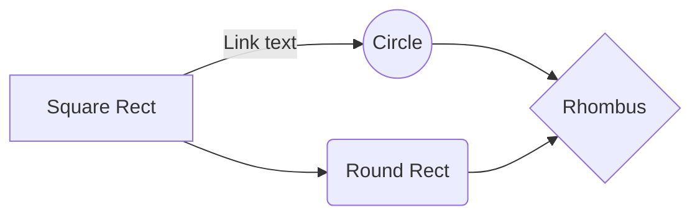

# Centrality Measures

Centrality measure are metrics to understand networks graphs, like Lighting network.

This is an attemt to define centrality metrics in an intuitive way that would make sense to folks without statistics background, ie for your grand mom.
 

## Intuitive definition

1.  **Degree Centrality**
        -   The social butterfly of the network. A node's importance is gauged by how many connections it has. More friends, more central.
2.  **Closeness Centrality**
        -   The node that’s never far from the action, able to whisper in every ear. Measured by how close it stands to every other node in the room, minimizing the whispers needed to spread a secret across the network.
3.  **Betweenness Centrality**
        -   The broker, the wheel-greaser, the node that lies on the shortest path between others, often controlling the flow of information. If it were a city, it would be Panama—a vital crossroads.
4.  **Eigenvector Centrality**
        -   Not just about having friends, but about having powerful friends. This measure looks at the influence of a node’s connections. In a room full of celebrities, it’s the one who knows the biggest stars.
5.  **Katz Centrality**
        -   Similar to its cousin, the Eigenvector, but adds a sprinkle of influence from all nodes within a few handshakes. It acknowledges even the faintest nod from across the room.
6.  **PageRank**
        -   The algorithm of the Internet age, crafted by Google’s own. Nodes gain status not just by having many connections, but how significant those connections are. It’s the difference between a nod from a king and a wave from a crowd.

# A Network Graph.

```mermaid
flowchart LR
    Sia --- Ria
    Ria --- Xi
    Xi --- Ivy
    Ivy --- Eva
    Sia --- Ivy
    Ria --- Ivy
    Ria --- Eva
   ```
   
## Calculation

#### Degree Centrality

Degree centrality for a node $v$ is given by:

$\text{Degree Centrality}(v) = \frac{\text{Degree of } v}{N-1}$

| Node | Degree ( # of nodes connected to) | Calculation                        | Degree Centrality |
|------|--------|------------------------------------|-------------------|
| Sia  | 2      | $\frac{2}{5-1} = \frac{2}{4}$      | 0.5               |
| Ria  | 4      | $\frac{4}{5-1} = \frac{4}{4}$      | 1.0               |
| Xi   | 2      | $\frac{2}{5-1} = \frac{2}{4}$      | 0.5               |
| Ivy  | 4      | $\frac{4}{5-1} = \frac{4}{4}$      | 1.0               |
| Eva  | 2      | $\frac{2}{5-1} = \frac{2}{4}$      | 0.5               |

#### Betweenness Centrality
$\text{Betweenness Centrality}(v) = \sum_{s \neq v \neq t} \frac{\sigma_{st}(v)}{\sigma_{st}}$


Below table shows shortest path count for each pair.

| Node Pair | Shortest Path Count | Path Details                            | Intermediary Nodes         |
|-----------|---------------------|-----------------------------------------|----------------------------|
| Sia - Ria | 1                   | Direct path                             | None                       |
| Sia - Xi  | 1                   | Path through Ria                        | Ria                        |
| Sia - Ivy | 1                   | Direct path                             | None                       |
| Sia - Eva | 2                   | 1 path through Ivy, 1 path through Ria  | Ivy, Ria                   |
| Ria - Xi  | 1                   | Direct path                             | None                       |
| Ria - Ivy | 1                   | Direct path                             | None                       |
| Ria - Eva | 1                   | Direct path                             | None                       |
| Xi - Ivy  | 1                   | Direct path                             | None                       |
| Xi - Eva  | 1                   | Path through Ivy                        | Ivy                        |
| Ivy - Eva | 1                   | Direct path                             | None                       |


| Node | Shortest Paths Through Node | Calculation | Betweenness Centrality |
|------|-----------------------------|-------------|------------------------|
| Sia  | 0                           | $0/10$      | $0.0$                  |
| Ria  | 2                           | $2/10$      | $0.2$                  |
| Xi   | 0                           | $0/10$      | $0.0$                  |
| Ivy  | 2                           | $2/10$      | $0.2$                  |
| Eva  | 0                           | $0/10$      | $0.0$                  |


#### Closeness Centrality

$\text{Closeness Centrality}(v) = \frac{N-1}{\sum_{u=1}^{N} d(v, u)}$
| Node | Sum of Distances to Other Nodes | Calculation       | Closeness Centrality |
|------|---------------------------------|-------------------|----------------------|
| Sia  | 6                               | $\frac{5-1}{6}$   | 0.67                 |
| Ria  | 5                               | $\frac{5-1}{5}$   | 0.8                  |
| Xi   | 6                               | $\frac{5-1}{6}$   | 0.67                 |
| Ivy  | 5                               | $\frac{5-1}{5}$   | 0.8                  |
| Eva  | 6                               | $\frac{5-1}{6}$   | 0.67                 |


$\text{Eigenvector Centrality}Ax = \lambda x$

$\text{Katz Centrality}(v) = \alpha \sum_{j=1}^{n} A_{ij} x_j + \beta$

$\text{PageRank}(p_i) = \frac{1-d}{N} + d \sum_{p_j \in M(p_i)} \frac{\text{PageRank}(p_j)}{L(p_j)}$


## Switch to another file

```mermaid
flowchart LR
    Ava --- Mia
    Mia --- Zoe
    Zoe --- Ivy
    Ivy --- Mya
    Mya --- Eva
    Eva --- Ida
    Ida --- Uma
    Uma --- Ava
    Zoe --- Eva
    Mia --- Ida
    Ava --- Uma
    Uma --- Ivy
    Ivy --- Zoe
    Zoe --- Mya
    Mya --- Uma
   ```

## Rename a file

You can rename the current file by clicking the file name in the navigation bar or by clicking the **Rename** button in the file explorer.

## Delete a file

You can delete the current file by clicking the **Remove** button in the file explorer. The file will be moved into the **Trash** folder and automatically deleted after 7 days of inactivity.

## Export a file

You can export the current file by clicking **Export to disk** in the menu. You can choose to export the file as plain Markdown, as HTML using a Handlebars template or as a PDF.


# Synchronization

Synchronization is one of the biggest features of StackEdit. It enables you to synchronize any file in your workspace with other files stored in your **Google Drive**, your **Dropbox** and your **GitHub** accounts. This allows you to keep writing on other devices, collaborate with people you share the file with, integrate easily into your workflow... The synchronization mechanism takes place every minute in the background, downloading, merging, and uploading file modifications.

There are two types of synchronization and they can complement each other:

- The workspace synchronization will sync all your files, folders and settings automatically. This will allow you to fetch your workspace on any other device.
	> To start syncing your workspace, just sign in with Google in the menu.

- The file synchronization will keep one file of the workspace synced with one or multiple files in **Google Drive**, **Dropbox** or **GitHub**.
	> Before starting to sync files, you must link an account in the **Synchronize** sub-menu.

## Open a file

You can open a file from **Google Drive**, **Dropbox** or **GitHub** by opening the **Synchronize** sub-menu and clicking **Open from**. Once opened in the workspace, any modification in the file will be automatically synced.

## Save a file

You can save any file of the workspace to **Google Drive**, **Dropbox** or **GitHub** by opening the **Synchronize** sub-menu and clicking **Save on**. Even if a file in the workspace is already synced, you can save it to another location. StackEdit can sync one file with multiple locations and accounts.

## Synchronize a file

Once your file is linked to a synchronized location, StackEdit will periodically synchronize it by downloading/uploading any modification. A merge will be performed if necessary and conflicts will be resolved.

If you just have modified your file and you want to force syncing, click the **Synchronize now** button in the navigation bar.

> **Note:** The **Synchronize now** button is disabled if you have no file to synchronize.

## Manage file synchronization

Since one file can be synced with multiple locations, you can list and manage synchronized locations by clicking **File synchronization** in the **Synchronize** sub-menu. This allows you to list and remove synchronized locations that are linked to your file.


# Publication

Publishing in StackEdit makes it simple for you to publish online your files. Once you're happy with a file, you can publish it to different hosting platforms like **Blogger**, **Dropbox**, **Gist**, **GitHub**, **Google Drive**, **WordPress** and **Zendesk**. With [Handlebars templates](http://handlebarsjs.com/), you have full control over what you export.

> Before starting to publish, you must link an account in the **Publish** sub-menu.

## Publish a File

You can publish your file by opening the **Publish** sub-menu and by clicking **Publish to**. For some locations, you can choose between the following formats:

- Markdown: publish the Markdown text on a website that can interpret it (**GitHub** for instance),
- HTML: publish the file converted to HTML via a Handlebars template (on a blog for example).

## Update a publication

After publishing, StackEdit keeps your file linked to that publication which makes it easy for you to re-publish it. Once you have modified your file and you want to update your publication, click on the **Publish now** button in the navigation bar.

> **Note:** The **Publish now** button is disabled if your file has not been published yet.

## Manage file publication

Since one file can be published to multiple locations, you can list and manage publish locations by clicking **File publication** in the **Publish** sub-menu. This allows you to list and remove publication locations that are linked to your file.


# Markdown extensions

StackEdit extends the standard Markdown syntax by adding extra **Markdown extensions**, providing you with some nice features.

> **ProTip:** You can disable any **Markdown extension** in the **File properties** dialog.


## SmartyPants

SmartyPants converts ASCII punctuation characters into "smart" typographic punctuation HTML entities. For example:

|                |ASCII                          |HTML                         |
|----------------|-------------------------------|-----------------------------|
|Single backticks|`'Isn't this fun?'`            |'Isn't this fun?'            |
|Quotes          |`"Isn't this fun?"`            |"Isn't this fun?"            |
|Dashes          |`-- is en-dash, --- is em-dash`|-- is en-dash, --- is em-dash|


## KaTeX

You can render LaTeX mathematical expressions using [KaTeX](https://khan.github.io/KaTeX/):

The *Gamma function* satisfying $\Gamma(n) = (n-1)!\quad\forall n\in\mathbb N$ is via the Euler integral

$$
\Gamma(z) = \int_0^\infty t^{z-1}e^{-t}dt\,.
$$

> You can find more information about **LaTeX** mathematical expressions [here](http://meta.math.stackexchange.com/questions/5020/mathjax-basic-tutorial-and-quick-reference).


## UML diagrams

You can render UML diagrams using [Mermaid](https://mermaidjs.github.io/). For example, this will produce a sequence diagram:

```mermaid
sequenceDiagram
Alice ->> Bob: Hello Bob, how are you?
Bob-->>John: How about you John?
Bob--x Alice: I am good thanks!
Bob-x John: I am good thanks!
Note right of John: Bob thinks a long<br/>long time, so long<br/>that the text does<br/>not fit on a row.

Bob-->Alice: Checking with John...
Alice->John: Yes... John, how are you?
```

And this will produce a flow chart:


<!--stackedit_data:
eyJoaXN0b3J5IjpbMTg5Nzk1MjA5MSwtMTM0NjExODcxNSwxMT
MzNTkzNTAzLDE1ODg3NDgyMzEsLTIxMzk1MzMwNzIsMzc1MDcw
OTQ2LC0xNzk5OTIxMTEyLDE1NTEyMzk1MDQsLTEyMzExODg2ND
gsLTY5ODI2NTI5MCwxMTU0NzUyNTg0LDk4NTQyNzM3OCwtMjEz
MDg1MjY3MCwtOTc4NTMyMDAxLDUxNzE5MTg1MCw4NjUwMjM2MS
w0MDY0NzY3NzcsLTE2NzA0MTk3MTksMjYzNTE4MDcxLDE4MjIx
NTE1MF19
-->