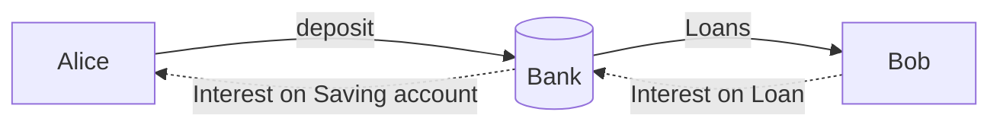

Invariably, you may hear that bitcoin is a passive asset. Here, I'll argue that bitcoin is not a 'passive' asset, and any time you try to make it more 'active' that it ought to be, you take a risk.  And, most of the time for most of the folks it is not worth it.

Simply, in one line, the answer is, since bitcoin is not inflationary, it is not a passive asset. On top of that, at least for now, you are making a bet on a new money, so 

## What is Active Asset and Passive Asset

Active assets are the assets that we make use of, passive assets are the one that we just hold, and do nothing with it. 

The example could be our home, we live in it, or we rent it out. When we niether live in our property, nor we rent it out, we can label it as a passive asset. It is a passive asset because if we put the asset to use, rent it out or do an AirBnB, we make the asset active and start making money out of it.

## The non zero risk of making an asset active

We make a home an active asset by renting it out. However, depending on the renter, and macro factors, it may turn out to be a money sink. The renter can make maintenance cost skyrocket, and it may overshoot the rental income. Even worse, virus could hit, and by mandate you are not able to collect rent for long.

The point being, anytime you are making money out of an asset you are taking a risk. Your life skills may give you an edge in managing risks and minimize expected loss. But in some case, specifically for bitcoin,  the equation of expected loss and incremental return, doesnt make it worth doing it.

## Is Bitcoin really a passive asset?

The analogy of keeping  bitcoin in cold wallet is similar to keeping  Dollar locked in cabinet or in a bank account is spurios one.

The act of  passively keeping $ in bank account hurts because: 
 - You get closer to zero interest rate
 - the real value of your dollar goes down because of money printing and resulting inlfation.

The act of passively keeping bitcoin in hard wallet  doesnt hurt even though
 - You get zero interest rate
because:
 - The real value of bitcoin is going up because of technology, financial and social adoption. It got fixed supply of 21m, and there is no government to  print' bitcoin at will to fund wars or to enrich the inner circle or to distribute a small percentage to chosen few to buy votes.

## Money printing , Inflation and Bitcoin

The supply of bitcoin is not going up, so there is no inflation, so value of bitcoin that you hold in your cold wallet is not going down like the dollar kept in your wallet.

## Lending, Altcoin and Layer 2 security and ...

Stocks is a way to own a piece of equity in a company. Very few would call equities a passive asset until Robinhood decided to launch equity lending for retail investors.  We are a level deeper into web of financialization.

Financialization in traditional market have problems, and gave us shock of 2008, and we may be due for another shock of century. However, in crypto market, those shocks are part of daily life. It is filled with scams, rug pools and charlatanism.

In short, the risks are too high.

## Putting it all together

## Inflation, Interest rate, Risk free rate & cost of capital and Bitcoin

Before thinking deeply about money printing, this is how I thought retail banks make money. Afterall this is what we are taught in schools

Banks pay low interest rate as they are trusted and secure. Banks know how to manage risk so that they can charge high interest rate from Bob, a business man, based on his risk profile.

In any case, for Alice, depositing money to bank would make sense if and only if

$$
Interest from saving account > Inflation rate
$$

In reality it is

$$
Interest from saving account > Inflation rate + risk free rate
$$

Imagine, if there is no inflation. This is the world you get in when you own and hold bitcoin.

Interest alice is getting paid has be 
However, in practical terms this has not been the case for long. It is becasue money printly ( increasing the money supply) doesn't cause real inflation to rise overnight. The economy is complicated, and because of thousands of moving pieces, it takes time.

Secondly, we

2nd, 
 $\Saving Interest rate (r) = (n-1)!\quad\forall n\in\mathbb N$ is via the Euler integral

$$
\Gamma(z) = \int_0^\infty t^{z-1}e^{-t}dt\,.
<!--stackedit_data:
eyJoaXN0b3J5IjpbMTg0ODg5MzI1N119
-->